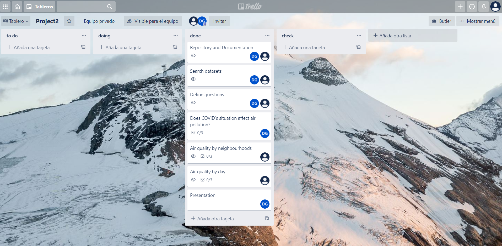

# Title of My Project
Daria Gavrilova and Àlex Gómez

Data Analytics FT OCT Barcelona 30/10/2020

## Content
- [Project Description](#project-description)
- [Questions & Hypotheses](#questions-hypotheses)
- [Dataset](#dataset)
- [Database](#database)
- [Workflow](#workflow)
- [Organization](#organization)
- [Links](#links)

## Project Description
This project aims to answer several questions regarding Barcelona's air quality. We decided to work in this topic as air pollution is a health risk for human lives that population has not enough awareness. In order to expose this issue many datasets are used to obtain objective and clear information with the goal to be able to state different facts of Barcelona's air quality situation.

## Questions & Hypotheses
In this project three questions are answered:
1. Has the COVID situation affected Barcelona's general air quality?
2. Which are the neighbourhoods with best and worst air quality?
3. There's a significant difference between workdays and weekends?

## Dataset
Datasets used in this project have been obtained form OPEN DATA BCN:
1. Air quality data from the measure stations of the city of Barcelona: these datasets contain the measurements of Barcelona's stations by month.
[Air quality data from the measure stations of the city of Barcelona](https://opendata-ajuntament.barcelona.cat/data/en/dataset/qualitat-aire-detall-bcn)  
2. Air quality measurement stations in the city of Barcelona: this dataset contains the information and characteristics regarding Barcelona's air quality measurement stations.
[Air quality measurement stations in the city of Barcelona](https://opendata-ajuntament.barcelona.cat/data/ca/dataset/qualitat-aire-estacions-bcn)
3. Pollutants measured by air quality measurement stations in the city of Barcelona: this dataset contains the information of the different pollutants measured by Barcelona's air quality measurement stations.
[Pollutants measured by air quality measurement stations in the city of Barcelona](https://opendata-ajuntament.barcelona.cat/data/ca/dataset/contaminants-estacions-mesura-qualitat-aire)

## Database
The structure of this project's database is formed by 4 tables, which are the following:
1. Main table: table containing all the data from the measure stations of the city of Barcelona of the year 2020.
2. May2019vsMay2020: table only containing the data from the measurement stations of the city of Barcelona of the May months of both years, 2019 and 2020.
3. Air quality by neighbourhood: table derived from the main table that also includes the location data of the measurement stations of Barcelona.
4. Air quality by day: table derived from the main table that also includes the week day of the day that every air quality measurement was done.

## Workflow
The workflow followed during the project is shown in the following image:

## Organization
At the beginning of this project, the organization of the project was made with a kanban board with the tool *Trello*. The different steps were defined and divided by the project members.

The repository of the project has the following folder structure:

- main folder named *'your-code'*: it contains all the subfolders and files of the project, including README.md
- subfolder named *'data'*: it contains all the datasets used in the project.
- file named *'air_quality'*: it is the module that contains the general code of the project. 

## Links
Include links to your repository, slides and kanban board. Feel free to include any other links associated with your project.

[Repository](https://github.com/agomezsegura/Project-Week-2-Barcelona)  
[Slides](https://slides.com/dariagavrilova-1/deck-a94ebf/review)  
[Trello](https://trello.com/b/yqJBfPlN/project2)  
